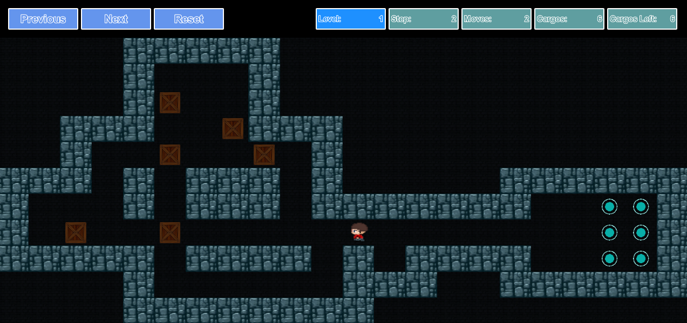
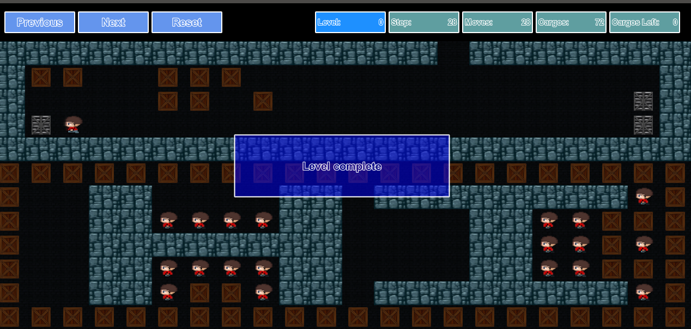

# Sokoban game

## The application is an custom implementation of [the Sokoban game created in 1982](https://en.wikipedia.org/wiki/Sokoban).

## Requirements

1. [Qt v5.0 (or high)](https://www.qt.io/)
2. [CMake v.3.5 (or high)](https://cmake.org/)

## Rules

The game is played on a board of squares, where each square is a floor or a wall. 
Some floor squares contain boxes and some floor squares are marked as storage locations.

1. The player is confined to the board and may move horizontally or vertically onto empty squares (never through walls or boxes). 
2. The player can move a box by walking up to it and push it to the square beyond. 
3. Boxes cannot be pulled, and they cannot be pushed to squares with walls or other boxes.
4. The number of boxes equals the number of storage locations. 
5. The puzzle is solved when all boxes are placed at storage locations.

## Description program files

1. ["GridGenerator"](./GridGenerator). Levels manager classes (use in gameplay c++ model).
2. ["Model"](./Model). Gameplay c++ model + Custom UndoCommand class.
3. ["StatStorage"](./StatStorage). Read (from qml module) / Write (from gameplay c++ model) game statistics.
4. ["resources"](./resources). UI implementation (qml files).

## Description other application files

1. ["data"](./data). Menu background image and levels file.
2. ["icons"](./icons). Tool bar icons (outdated).
3. ["sounds"](./sounds). Application audio files (currently only use for game buttons).
3. ["sprites"](./sprites). Gameplay sprites for drawing.

## Screenshots

