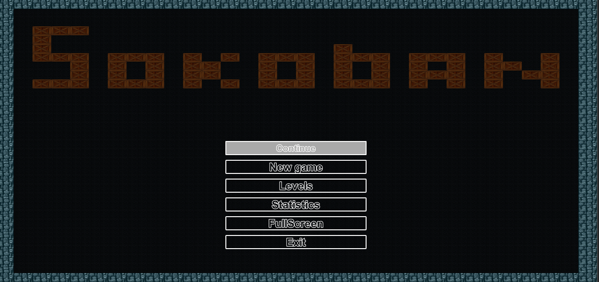

# UI implementation

## Description

* Application window creating in [sokoban.qml](./sokoban.qml)
* Interface consists of two main qml item: Main menu ([WindowMainMenu.qml](./WindowMainMenu.qml)) and Gameplay ([WindowGameplay.qml](./WindowGameplay.qml)). These elements are interchangeable and load when certain events are triggered.
* [gameplay](./gameplay) and [mainMenu](./mainmenu) folders contain qml types used for them.
* [items](./items). Contains basic qml types for the application, which are then used in other components.

### Main menu

### Gameplay
